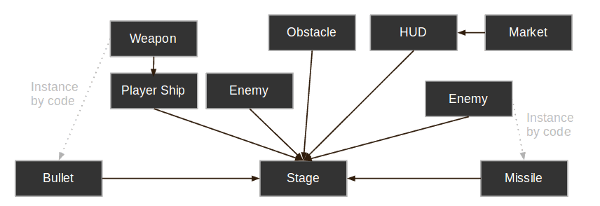
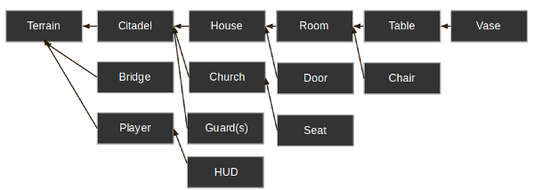
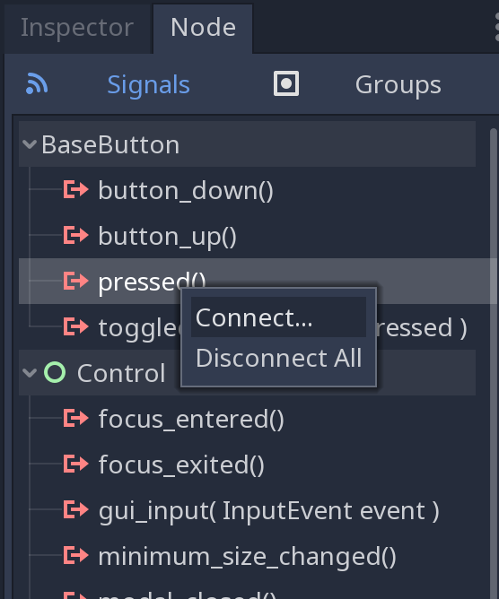

- [Godot3游戏引擎入门之零一：【翻译】为什么要选择 Godot 引擎](https://blog.csdn.net/SpkingR/article/details/82020539)

- [Roadmap](https://github.com/godotengine/godot-roadmap/blob/master/ROADMAP.md)

- [Godot Engine](https://github.com/godotengine)


# Docs

- [Godot Docs](http://docs.godotengine.org/en/stable/)

# Notes

## 2019 4 4




```js
Scene:{
    Name,
    Properties,
    Script,
    Nodes,
}
```

Node also can be a Scene.

#### Connect signals to script

Connect in `Signals` or in `func _ready()`, for example, connect button's 'pressed' signal:

manually:

```js
func _ready():
	get_node("Button").connect("pressed", self, "_on_Button_pressed")

func _on_Button_pressed():
	get_node("Label").text = "HELLO!"
```

or:




Get a button in label:

```
get_node("Label/Button")
```

Nodes are referenced by name, not by type.

#### idle processing, physics processing

## 2019 4 8

#### group, loop

For example, change the whole label's text in a group.

Add labels to `Group Labels`, and

```js
func _ready():
    add_to_group("Labels")
    
func _on_Button_pressed():
    var labels = get_tree().get_nodes_in_group("Labels")
        for label in labels:
            label.text = "asb"
```

Or something like a object, you can call its method like:
```js
func _ready():
    add_to_group("horses_group")

func _on_Button_pressed():
    get_tree().call_group("horses_group", "run")
```

#### overrideable funtions

```python
func _enter_tree():
    # When the node enters the _Scene Tree_, it becomes active
    # and  this function is called. Children nodes have not entered
    # the active scene yet. In general, it's better to use _ready()
    # for most cases.
    pass

func _ready():
    # This function is called after _enter_tree, but it ensures
    # that all children nodes have also entered the _Scene Tree_,
    # and became active.
    pass

func _exit_tree():
    # When the node exits the _Scene Tree_, this function is called.
    # Children nodes have all exited the _Scene Tree_ at this point
    # and all became inactive.
    pass

func _process(delta):
    # This function is called every frame.
    pass

func _physics_process(delta):
    # This is called every physics frame.
    pass
```

#### Add node and delete it

```python
var myLabel
func _ready():
	myLabel = Label.new()
	myLabel.text = "My new label."
    add_child(myLabel)
func _on_Button_pressed():
#    myLabel.free() # Immediately removes the node from the scene and frees it.
    # safty way:
    myLabel.queue_free()    # Removes the node from the scene and frees it when it becomes safe to do so.
```

#### Instancing scenes

```python
var scene = load("res://Processing.tscn") # Will load when the script is instanced.
# or
var scene = preload("res://Processing.tscn") # Will load when parsing the script.

func _ready():
    var node = scene.instance()
    add_child(node)
```

#### signals

`<source_node>.connect(<signal_name>, <target_node>, <target_function_name>)`

Root node script:
```js
extends Node

signal my_signal

func _ready():
	$Timer.connect("timeout", $Label, "_on_Timer_timeout", [$Sprite])
	self.connect("my_signal", $Label, "_on_Signal", [])
	emit_signal("my_signal")
```

Label's script:

```js
extends Label

func _ready():
	pass # Replace with function body.

func _on_Timer_timeout(sprite):
	sprite.visible = !sprite.visible
	self.text = String(sprite.visible)
	
func _on_Signal():
	self.text = "ready"
```

#### `export` keyword

Using the `export` keyword on the first variable `speed` allows us to set its value in the Inspector. 

```js
extends Area2D

export var speed = 400
```

#### `$` <-> `get_node()`

`$` is shorthand for `get_node()`. For example, `$AnimatedSprite.play()` is the same as `get_node("AnimatedSprite").play()`.

#### [Duplicating a node should result in either a true Instance or true unique copy, not a mix of both #317](https://github.com/godotengine/godot-proposals/issues/317#issuecomment-567048604)

set `Inspector>Shape>Resource>Local To Scene` to true.

```
bool resource_local_to_scene

If true, the resource will be made unique in each instance of its local scene. It can thus be modified in a scene instance without impacting other instances of that same scene.
```